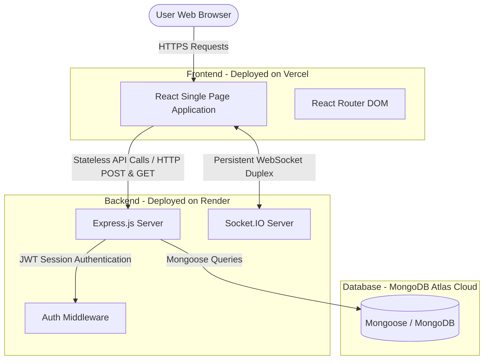

# 🛠️ ToolSwap — Collaborative Tool-Sharing Community Platform

ToolSwap is a modern, community-based peer-to-peer web application where neighbors can borrow and lend tools locally. It reduces consumer waste, saves money, and builds cooperative neighborhoods by enabling users to sign up, catalog items they own, search for available gear, and coordinate pickups via real-time chat.

---

## 📌 Table of Contents
* [🚀 Key Features](#-key-features)
* [💻 Technology Stack](#-technology-stack)
* [📐 System Architecture](#-system-architecture)
* [📂 Directory structure](#-directory-structure)
* [⚙️ Configuration & Environment Variables](#%EF%B8%8F-configuration--environment-variables)
* [🛠️ Local Installation & Development](#%EF%B8%8F-local-installation--development)
* [🌐 Cloud Deployment Guide](#-cloud-deployment-guide)
* [🛡️ Admin Dashboard Features](#%EF%B8%8F-admin-dashboard-features)

---

## 🚀 Key Features

* **Real-time Communication**: Chat seamlessly with lenders using WebSockets (Socket.IO) to negotiate pickups and dropoffs.
* **Smart Dashboard & Profile Auditing**: Review detailed histories of all lent out and borrowed items, reputation scores, and warning logs.
* **Admin Moderation Console**: Fully featured moderation panel allowing administrators to verify user identities, review flagged listings, manage borrower violations, and broadcast alerts.
* **Dynamic Search & Filters**: Search listings by categories, keyword queries, and geographic location.
* **Gamification & Leaderboard**: Earn community points and track top lenders on the community leaderboard.

---

## 💻 Technology Stack

| Layer | Technology | Purpose |
| :--- | :--- | :--- |
| **Frontend** | React, Vite | Single-page UI framework and build tool |
| **Styling** | Tailwind CSS | Sleek, modern, and responsive user interfaces |
| **Routing** | React Router DOM | Dynamic front-end routing |
| **Real-time** | Socket.IO Client | Real-time chat messaging and user-online indicator |
| **Backend** | Node.js, Express.js | API server framework |
| **Database** | MongoDB, Mongoose | Document storage and Object Data Modeling (ODM) |
| **Auth** | JWT (JSON Web Tokens) | Secure stateless user session validation |
| **Encryption** | bcrypt | Hashing passwords securely before database write |
| **Mailing** | Nodemailer | Transactional emails and notices |

---

## 📐 System Architecture

Below is the design showing how the components interact in production:



---

## 📂 Directory Structure

* **[Backend/app.js](file:///c:/Users/rajha/OneDrive/Desktop/ToolSwap1/Backend/app.js)**: Server initialization, socket hookups, and database migrations.
* **[Backend/routes/userRoute.js](file:///c:/Users/rajha/OneDrive/Desktop/ToolSwap1/Backend/routes/userRoute.js)**: Backend endpoints for admin statistics, profile management, and member verification.
* **[Backend/models/tool.js](file:///c:/Users/rajha/OneDrive/Desktop/ToolSwap1/Backend/models/tool.js)**: Schema definition for listed items (including flags, conditions, reviews, and borrow histories).
* **[Frontend/src/components/AdminDashboard.jsx](file:///c:/Users/rajha/OneDrive/Desktop/ToolSwap1/Frontend/src/components/AdminDashboard.jsx)**: Admin control panel component with profile auditing, listing moderation, and broadcast utilities.

---

## ⚙️ Configuration & Environment Variables

### Backend Configuration (`Backend/.env`)
Create a `.env` file in the `Backend` directory for local development, and configure these variables in the **Render Dashboard Environment** for production:

```ini
PORT=3000
MONGO_URI=mongodb+srv://<username>:<password>@<cluster>.mongodb.net/ToolShare
JWT_SECRET=your_jwt_signing_secret
FRONTEND_URL=https://tool-swap.vercel.app
EMAIL_USER=your_notification_email@gmail.com
EMAIL_PASS=your_email_app_password
```

### Frontend Configuration (`Frontend/.env` / Vercel Environment Variables)
Configure these on your **Vercel Project Dashboard** (or locally as `.env` inside `Frontend`):

```ini
VITE_API_URL=https://toolswap-nbor.onrender.com
VITE_SOCKET_URL=https://toolswap-nbor.onrender.com
```

---

## 🛠️ Local Installation & Development

### 1. Prerequisite Checks
Ensure you have the following installed:
* [Node.js](https://nodejs.org/) (v18 or higher)
* [MongoDB](https://www.mongodb.com/) running locally (for offline testing)

### 2. Backend Setup
1. Navigate to the `Backend` folder:
   ```bash
   cd Backend
   ```
2. Install packages:
   ```bash
   npm install
   ```
3. Run the development server using nodemon:
   ```bash
   npx nodemon
   ```

### 3. Frontend Setup
1. Navigate to the `Frontend` folder:
   ```bash
   cd ../Frontend
   ```
2. Install packages:
   ```bash
   npm install
   ```
3. Launch Vite development server:
   ```bash
   npm run dev
   ```
4. Access locally at: `http://localhost:5173`

---

## 🌐 Cloud Deployment Guide

### Deploying the Backend on Render
1. Create a **Web Service** pointing to your Github Repository.
2. Select the **Root Directory** as `Backend`.
3. Set the **Start Command** to: `npm start`.
4. Under the **Environment** tab, fill out all your environment variables (e.g. `MONGO_URI`, `JWT_SECRET`, `FRONTEND_URL`).
5. Render will automatically build, link your database, and run.

### Deploying the Frontend on Vercel
1. Create a **New Project** pointing to your Github Repository.
2. Set the **Root Directory** as `Frontend`.
3. Ensure the Build settings are:
   * Build Command: `npm run build`
   * Output Directory: `dist`
4. Add your **Environment Variables** (`VITE_API_URL` and `VITE_SOCKET_URL`).
5. Click **Deploy**. Vercel will build the React bundle and deploy it to a production URL (e.g., `https://tool-swap.vercel.app`).

> [!NOTE]
> Single Page Applications (SPAs) with client-side routing require rewrite configurations on Vercel. We have bundled a [vercel.json](file:///c:/Users/rajha/OneDrive/Desktop/ToolSwap1/Frontend/vercel.json) file inside the `Frontend` folder that automatically routes all client-side page paths to `index.html` to prevent direct-access `404: NOT_FOUND` errors.

---

## 🛡️ Admin Dashboard Features

The dashboard console includes:
* **Overview Analytics**: Visual representations of user registrations, items listed, active transactions, and flags.
* **Member Audit Profile Modal**:
  * Displays **Total Lent Out** and **Total Borrowed** metrics.
  * Deep audit tabs for detailed histories of requested and lent tools, showing real tool details (thumbnails, categories, dates, and names).
* **Identity Management**: Quick actions to verify profiles, suspend violating accounts, or ban bad actors.
* **Listing Moderation**: Review reported tools and either approve them or remove them permanently.
* **Broadcast Alerts**: Write and send real-time system bulletins to all or select segments of the community.
